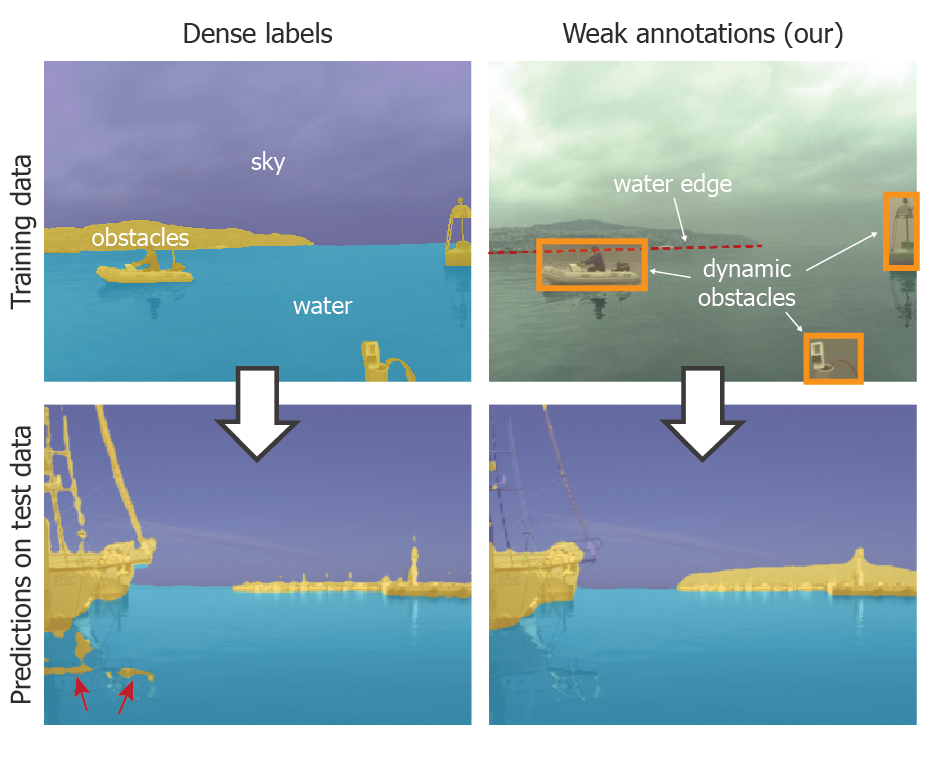
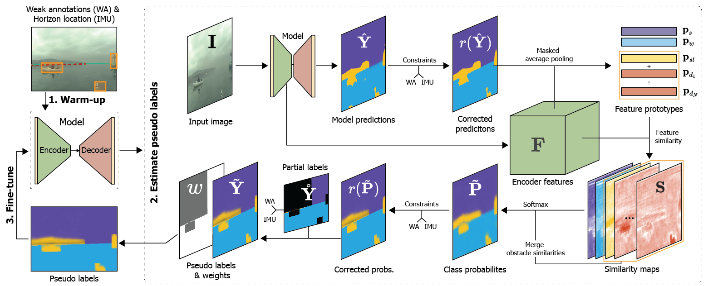

# Scaffolding Learning Regime (SLR)

[](https://arxiv.org/abs/2206.13263)
[](#pretrained-models)
[](https://www.youtube.com/watch?v=F4sLbbMsoHw)
[](#cite)


A PyTorch implementation of the Scaffolding Learning Regime (SLR) for training obstacle detection models for aquatic domains.


<p align="center">
    
</p>

**November 2022**: Published in MDPI Sensors.  
**January 2022**: Preliminary version presented at WACV.

## About SLR

Scaffolding Learning Regime (SLR) is a method for training semantic segmentation models for maritime obstacle detection using only weak annotations (obstacle bounding boxes and water-edge poly-line). Despite a **signifficant reduction in annotation time (20x)**, SLR training **improves robustness** of networks for obstacle detection, which is a remarkable result.



SLR is comprised of three steps.
1) The model is warmed-up using object-wise and global objectives derived from weak annotations and IMU.
2) he learned encoder features and model predictions are used to estimate the pseudo labels.
3) The network is fine-tuned on the estimated pseudo labels. 

For additional details please refer to the [paper](https://arxiv.org/abs/2206.13263).


## Getting started

### Installation

1. Clone the repository
    ```bash
    git clone https://github.com/lojzezust/SLR
    cd SLR
    ```
2. Install the requirements
    ```bash
    pip install -r requirements.txt
    ```
3. Install SLR. Use the `-e` flag if you want to make changes.
    ```bash
    pip install -e .
    ```
4. Link datasets directory and create an output directory.
    ```bash
    ln -s path/to/data data
    mkdir output
    ```

### Preparing the data

1. Download the [MaSTr1325 dataset](https://box.vicos.si/borja/viamaro/index.html) and corresponding [weak annotations](https://github.com/lojzezust/SLR/releases/download/weights_v2/mastr_slr.zip). The weak annotation archive also includes automatically generated prior obstacle segmentation masks (i.e. using DEXTR).
2. Use a script to prepare the data.
    ```bash
    python tools/prepare_data.py
    ```
    The preparation script performs the following operations:
    1. Prepares object masks - converts bounding boxes from weak annotations into masks used in training
    2. Prepares pairwise similarity maps - pre-computes the neighbor similarities used by the pairwise loss
    3. Prepares partial masks - compute the partial masks used in the warm-up phase. Partial masks are constructed from weak annotations and IMU horizon masks.
    4. Prepares the prior obstacle segmentation masks - reads RLE encoded Dextr predictions and adds sky and water segmentation based on IMU horizon masks and partial labels.
    5. Creates a dataset file `all_weak.yaml`, which links the prepared dataset directories for training.

### SLR Training

Use the utility script `tools/train_slr.sh` to train a model using the entire SLR pipeline. 

```bash
chmod +x tools/train_slr.sh
tools/train_slr.sh
```

The script contains the following variables, that can be changed to achieve the desired results.

- `MASTR_DIR`: Location of the dataset used for training.
- `ARCHITECTURE`: Which architecture to use (use `python tools/train.py warmup --help` for more info).
- `MODEL_NAME`: Name of the model. Used for saving logs and weights.
- `BATCH_SIZE`: Batch size per gpu.
- `WARMUP_EPOCHS`: Number of epochs for the warm-up phase.
- `FINETUNE_EPOCHS`: Number of epochs for the fine-tuning phase.
- `NUM_ITER`: Number of iterations of the SLR pseudo label estimation and fine-tuning.

### Individual training steps

Individual steps of the SLR pipeline can also be executed separately, with the following python scripts.

#### Step I: Feature warm-up

Train an initial model on partial labels generated from weak annotations and IMU. Uses additional object-wise losses.
```bash
export CUDA_VISIBLE_DEVICES=0,1
python tools/train.py warmup \
--architecture wasr_resnet101_imu \
--model-name wasr_slr_warmup \
--batch-size 4
```

> [!TIP]
> Use the `--help` switch for more details on all possible arguments and settings.

#### Step II: Generate pseudo labels

Generate pseudo labels by refining model predictions with learned features.
```bash
export CUDA_VISIBLE_DEVICES=0,1
python tools/generate_pseudo_labels.py \
--architecture wasr_resnet101_imu \
--weights-file output/logs/wasr_slr_warmup/version_0/checkpoints/last.ckpt \
--output-dir output/pseudo_labels/wasr_slr_warmup_v0
```

This creates the pseudo-labels and stores them into `output/pseudo_labels/wasr_slr_warmup_v0`.

> [!TIP]
> Use the `--help` switch for more details on all possible arguments and settings.

#### Step III: Fine-tune model

Fine-tune the initial model on the estimated pseudo-labels from the previous step. 
The model is initialized with weights of the initial model.

```bash
export CUDA_VISIBLE_DEVICES=0,1
python tools/train.py finetune \
--architecture wasr_resnet101_imu \
--model-name wasr_slr \
--batch-size 4 \
--pretrained-weights output/logs/wasr_slr_warmup/version_0/checkpoints/last.ckpt \
--mask-dir output/pseudo_labels/wasr_slr_warmup_v0
```

> [!TIP]
> Use the `--help` switch for more details on all possible arguments and settings.

### Inference

#### General inference

Run inference using a trained model. `tools/general_inference.py` script is able to run inference on a directory of images recursively. It replicates the directory structure in the output directory.

```bash
export CUDA_VISIBLE_DEVICES=0,1
python tools/general_inference.py \
--architecture wasr_resnet101 \
--weights-file output/logs/wasr_slr_v2_it1/version_0/checkpoints/last.ckpt \
--image-dir data/example_dir \
--output-dir output/predictions/test_predictions
```

Additionally, `--imu-dir` can be used to supply a directory with corresponding IMU horizon masks. The directory structure should match the one of image dir.

> [!NOTE]
> The IMU dir has to be provided for models architectures relying on IMU data (i.e. WaSR with IMU).

> [!TIP]
> Use the `--help` switch for more details on all possible arguments and settings.

#### MODS inference

`tools/mods_inference.py` can be used in a similar fashion to run inference on the MODS benchmark.

> [!TIP]
> Use the `--help` switch for more details on all possible arguments and settings.

## Pretrained models

Currently available pretrained model weights. All models are trained on the MaSTr1325 dataset using SLR and weak annotations and evaluated on the [MODS benchmark](https://github.com/bborja/mods_evaluation). 

F1 obstacle detection scores are reported overall and separately within the 15m critical danger zone around the boat.

| architecture       | backbone   | IMU | url                                                                                                        | $\mathrm{F1}$ | $\mathrm{F1}_D$ |
|--------------------|------------|-----|------------------------------------------------------------------------------------------------------------|---------------|-----------------|
| wasr_resnet101     | ResNet-101 |     | [weights](https://github.com/lojzezust/SLR/releases/download/weights_v2/wasr_slr_v2_rn101.pth)             | 94.4          | 92.0            |
| wasr_resnet101_imu | ResNet-101 |  ✓  | [weights](https://github.com/lojzezust/SLR/releases/download/weights_v2/wasr_slr_v2_rn101_imu.pth)         | 94.9          | 93.7            |


## Cite

You can use the following BibTeX entry to cite this work:

```bibtex
@article{Zust2022Learning,
    author = {Žust, Lojze and Kristan, Matej},
    title = {Learning with Weak Annotations for Robust Maritime Obstacle Detection},
    journal = {Sensors},
    volume = {22},
    year = {2022},
    number = {23},
    article-number = {9139},
    url = {https://www.mdpi.com/1424-8220/22/23/9139},
    issn = {1424-8220},
    doi = {10.3390/s22239139}
}
```
